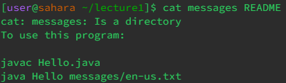
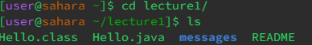
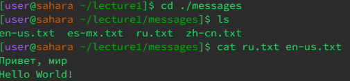
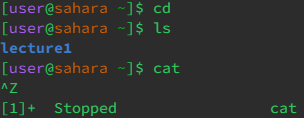

**lab report 1**

with the directory cat path it is adding the two files `README` and `messages`

this sets the path to `lecture1` and then `ls` says whats in the file which is the hello.class , hello.java, messages and README

This one contains the path all the way into the messages and then with `ls` it lists all the txt files with the cat then combining the english and russian text

without the arguments it doesnt do much other than just in `ls` when it just says lecture1.
With the `cat` command not doing anything I had to stop the command since it would not combinate anything with no arguments
